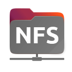
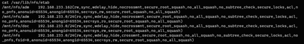
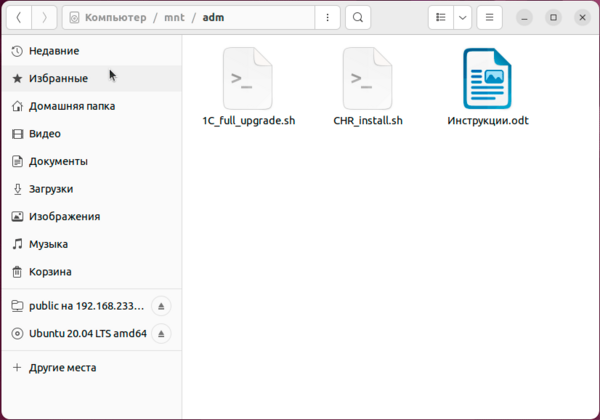

# NFS в Linux



NFS (Network File System) - сетевая файловая система в Linux и UNIX-like системах позволяющая монтировать сетевые ресурсы удаленного компьютера и работать с ними как с локальными. Это стандартный и достаточно производительный способ работы с файлами по сети, использование которого более предпочтительно для обмена данными в однородной Linux среде, особенно в тех случаях, когда требуется постоянный доступ к ресурсам. В этой статье мы рассмотрим, как настроить собственный сервер NFS на базе Debian или Ubuntu, а также как получить к нему доступ из удаленных систем.

Как и любой протокол с большой историей NFS имеет несколько версий, актуальной версией на сегодняшний день является NFS v4 и следует использовать именно ее, в некоторых случаях, обычно в целях совместимости можно использовать версию NFS v3, более ранние версии являются устаревшими и к применению категорически не рекомендуются.

Пользователям пришедшим из Windows систем концепция NFS может показаться несколько непонятной, так как они привыкли, что общий ресурс - это сетевое расположение, доступное на удаленном ПК - файловом сервере и доступ к нему можно получить сразу через сетевое окружение, ну или подключить в виде сетевого диска.

В Linux все немного по-другому, файловая система здесь иерархична и начинается всегда от корня, поэтому любые данные, вне зависимости, где они находятся, на внутренних носителях или в локальной сети должны быть подключены к этой иерархии, место такого подключения называется точкой монтирования, после чего вы сможете работать с этими данными точно также как и с локальными, никакой разницы для системы нет.

Поэтому NFS - это не файловый сервер, а именно сетевая файловая система, хотя и построена по клиент-серверной схеме.

### Установка и настройка NFS-сервера

Прежде всего продумаем структуру данных, NFS v4 требует, чтобы все экспортируемые директории находились в пределах одной общей директории, называемой корневой. На первый взгляд все просто, создаем корень NFS, скажем в **/mnt**, и добавляем туда несколько экспортируемых папок:

```
mkdir /mnt/nfs  
mkdir /mnt/nfs/adm  
mkdir /mnt/nfs/doc
```

В целях безопасности NFS умеет понижать права подключившихся пользователей до **nobody:nogroup** и это хорошая практика для общих ресурсов, рекомендуем ее использовать. Поэтому сразу сменим владельца директории:

```
chown -R nobody:nogroup /mnt/nfs
```

Важный момент - в экспортируемых расположениях не должно быть символических ссылок, либо они также должны быть доступны на клиенте, в противном случае они не будут работать. Поэтому если нам надо экспортировать директорию, лежащую за пределами корня NFS, то нам потребуется ее смонтировать.

Например, мы хотим поделиться по сети директорией **/home/ivanoff/music**, для этого создадим точку монтирования:

```
mkdir /mnt/nfs/music
```

А затем добавим в **/etc/fstab** запись:

```
/home/ivanoff/music  /mnt/nfs/music  none  bind  0  0
```

Теперь каталог с музыкой будет автоматически монтироваться в расположение NFS при загрузке системы, чтобы выполнить монтирование без перезагрузки выполните:

```
mount -a
```

После того, как вы создали необходимую структуру хранения данных установим сам NFS-сервер:

```
apt install nfs-kernel-server
```

Все экспортируемые файловые системы должны быть описаны в **/etc/exports**, начнем с корневой, добавим строку:

```
/mnt/nfs 192.168.233.0/24(rw,sync,crossmnt,fsid=0,no_subtree_check,wdelay,all_squash)
```

Давайте разберем ее подробнее:

* **/mnt/nfs** - путь к экспортируемым данным
* **192.168.233.0/24** - адрес, которому разрешается доступ, можно указать **\*** - всем, сеть или отдельный адрес или имя хоста

Далее в скобках идут опции, которые относятся к указанному адресу, обратите внимание, что **пробела** между адресом и скобкой **быть не должно**.

* **rw** - разрешаем запись в экспортируемую директорию
* **sync** - сообщать клиенту об успешной записи, только после фактической записи на диск, несколько замедляет работу, но предотвращает возможную потерю данных
* **crossmnt** - автоматически монтировать вместе с корневой файловой системой все вложенные
* **fsid=0** - признак корневой файловой системы
* **no\_subtree\_check** - если экспортируется подкаталог, то система будет проверять находится ли запрошенный файл в экспортированном подкаталоге, отключение проверки несколько снижает безопасность, но увеличивает производительность
* **wdelay** - позволяет серверу откладывать запись, если он предполагает, что планируется еще одна операция записи, чтобы потом записывать данные большими блоками. Увеличивает производительность при большой глубине очереди
* **all\_squash** - понижать права всех пользователей до **nobody:nogroup**

На последней опции остановимся более подробно, NFS по умолчанию не использует аутентификацию и доступ разграничивается по IP-адресам и стандартным UNIX-правам. При этом важно понимать, что права определяются не по имени пользователя, а по его UID/GID, т.е. идентификаторам. В целях безопасности NFS умеет понижать права до минимальных, но по умолчанию это применяется только к суперпользователю, а обычные пользователи будут подключаться со своими UID/GID, но так как мы назначили владельцем экспортируемых директорий **nobody:nogroup**, то нам нужно также понизить в правах и обычных пользователей, либо пересмотреть всю систему прав доступа.

Отдельно бы хотелось предостеречь от использования опции **no\_root\_squash**, которая отключает понижение прав root при подключении к NFS, это очень большая дыра в безопасности, так как позволяет пользователю с **локальными** правами администратора залить на сервер исполняемый файл с установленным битом SUID, что будет означать смену прав на суперпользователя при его запуске из-под обычной учетной записи.

Затем подключим остальные экспортируемые директории:

```
/mnt/nfs/doc 192.168.233.0/24(rw,sync,no_subtree_check,wdelay,all_squash)  
/mnt/nfs/adm 192.168.233.0/24(rw,sync,no_subtree_check,wdelay,all_squash)
```

Здесь все стандартно: путь, адрес и опции для этого адреса.

А как быть, если надо подключить разные адреса с разным набором опций? Просто добавьте в строку нужное количество адресов и укажите нужные вам опции:

```
/mnt/nfs/adm 192.168.233.101(...) 192.168.233.102(...)
```

Осталось разобраться с последним экспортируемым ресурсом, который мы примонтировали из домашней папки пользователя. Понятно, что владельцем файлов в ней является сам пользователь и попытки обратиться туда с минимальными правами не увенчаются успехом. Поэтому немного изменим строку экспорта:

```
/mnt/nfs/music 192.168.233.0/24(rw,sync,no_subtree_check,wdelay,all_squash,anonuid=1001,anongid=1001)
```

Здесь у нас добавились две новые опции:

* **anonuid** - переопределяет идентификатор анонимного пользователя
* **anongid** - переопределяет группу анонимного пользователя

Обе этих опции работают совместно с **all\_squash** и предполагается что 1001 - это UID/GID пользователя **ivanoff**, из домашней директории которого мы примонтировали этот ресурс.

После того как вы добавили в файл все экспортируемые ресурсы, выполните команду:

```
exportfs -ra
```

Перезапустить или проверить статус службы вы можете командами:

```
systemctl restart|status nfs-server
```

После чего полезно посмотреть полный набор используемых опций для каждого экспортируемого ресурса, для чего выполните:

```
cat /var/lib/nfs/etab
```

Как видим, набор опций в выводе гораздо шире указанных нами, так как тут также перечислены опции применяемые по умолчанию.



На этом настройка NFS сервера закончена. Для работы сервера в версии NFS v4 необходимо разрешить доступ к порту **2049** по TCP и UDP.

### Установка и настройка NFS-клиента

Для работы с NFS в качестве клиента нам потребуется установить пакет **nfs-common**:

```
apt install nfs-common
```

Никакой дополнительной настройки пакет не требует.

Теперь попробуем выполнить подключение, сначала в ручном режиме. Прежде всего создадим точки монтирования, куда будет подключаться сетевая файловая система. Например:

```
mkdir /mnt/adm
```

После чего смонтируем в нее одноименный экспортируемый ресурс:

```
mount -t nfs4 192.168.233.184:/adm /mnt/adm
```

В команде монтирования для указания нужного ресурса используется синтаксис **server:/export**, пути к экспортируемым ресурсам указываются относительно корневой директории NFS-сервера. В нашем случае сервер представлен IP-адресом **192.168.233.184**, а экспортируем мы ресурс **/mnt/nfs/adm**.

Если все сделано правильно, то можете открыть указанную точку монтирования и убедиться, что в ней присутствует содержимое сетевой файловой системы.

[]

Также проверить монтирование и получить полную информацию о примонтированных NFS-ресурсах можно командой:

```
mount -t nfs4
```

Для того, чтобы отмонтировать ресурс используйте команду:

```
umount /mnt/adm
```

В качестве аргумента укажите точку монтирования.

#### Постоянное монтирование NFS при помощи fstab

Самый простой, но не самый удобный и, по сегодняшним меркам, несколько устаревший способ. Откройте файл **/etc/fstab** и добавьте в него строку:

```
192.168.233.184:/adm /mnt/adm nfs4 defaults 0 0
```

Теперь сетевая файловая система будет автоматически монтироваться при загрузке компьютера. Чтобы выполнить монтирование без перезагрузки используйте:

```
mount -a
```

К недостаткам данного способа относится то, что в случае плохого канала связи с NFS-сервером может наблюдаться значительная задержка при загрузке системы, однако если сервер полностью недоступен монтирование производиться не будет.

#### Постоянное монтирование NFS при помощи systemd

Для монтирования при помощи systemd используются специальные юниты, имя которых должно отображать физический путь к ним, чтобы сформировать имя на основании пути используйте команду:

```
systemd-escape -p "/mnt/adm"
```

Для указанного пути в выводе получим имя **mnt-adm**, после чего создадим юнит монтирования и откроем его редактором nano, если вы предпочитаете редактор mc, то замените в команде nano на mcedit:

```
nano /etc/systemd/system/mnt-adm.mount
```

И внесем в него следующий текст:

```
[Unit]  
Description=NFS ADM  
  
[Mount]  
What=192.168.233.184:/adm  
Where=/mnt/adm  
Type=nfs4  
Options=_netdev,auto  
TimeoutSec=10  
  
[Install]  
WantedBy=multi-user.target
```

Здесь все достаточно просто, в опции **What** указываем сетевой ресурс, а в опции **Where** - точку монтирования.

Затем создадим еще один юнит, для автомонтирования ресурса по требованию, это наиболее удобный вариант и рекомендуется разработчиками для сетевых и съемных ресурсов.

```
nano /etc/systemd/system/mnt-adm.automount
```

В нем разместим следующие строки:

```
[Unit]  
Description=Automount NFS ADM  
  
[Automount]  
Where=/mnt/adm  
TimeoutIdleSec=900  
  
[Install]  
WantedBy=multi-user.target
```


Теперь перечитаем список юнитов, добавим юнит автомонтирования в автозагрузку и сразу запустим.

```
systemctl daemon-reload  
systemctl enable --now mnt-adm.automount
```

Перезагружать систему не надо, при работающем юните достаточно обратиться к указанной точке монтирования, и сетевая файловая система будет подключена автоматически.

