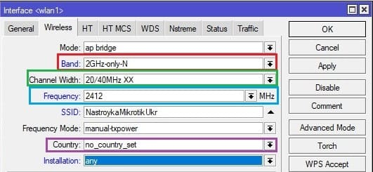
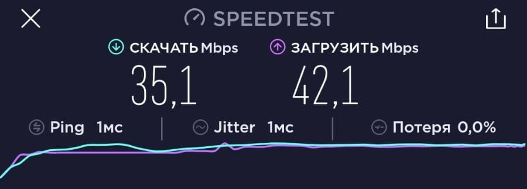

# Инструкции по настройке MikroTik

## Инструкция настройки WiFi в MikroTik

1. **[Настройка пароля WiFi](#wifi-mikrotik_1)**
2. **[Расширенная настройка WiFi в MikroTik](#wifi-mikrotik_3)**
   * **[Настройка WiFi 2.4ГГц](#mikrotik-wifi-2g)**
   * **[Настройка WiFi 5ГГц](#mikrotik-wifi-5g)**
3. **[Настройка скорости и мощности WiFi](#wifi-mikrotik_4)**
4. **[Тестирование скорости Speedtest](#mikrotik-wifi)**

## Отличие настройки CAPsMAN на точке доступа MikroTik

**CAPsMAN** это менеджер, который выполняет роль **WiFi контроллера**. Его прямая задача облегчить масштабируемость WiFi сети и актуальность возникает, когда в сети **MikroTik** появляется вторая точка доступа WiFi. Среди полезных функций можно отметить наличие **Fast Rouming**, которая обеспечивает быстрое переключение между точками доступа при перемещении WiFi клиента по зоне покрытия.


Обычная настройка WiFi(раздел Wireless) относится только к текущей точке доступа и не будет распространяться на смежные устройства.

## Настройка пароля WiFi в MikroTik

Заводские настройки безопасности WiFi не имеют предустановленного пароля. Такие параметры применяются производителем для упрощения первичной настройки WiFi в MikroTik. Однако с точки зрения безопасности ИТ инфраструктуры и работоспособности WiFi, необходимо в обязательном порядке установить новый пароль к WiFi.

## Нужна настройка WiFi в MikroTik?

**Правильная настройка:** «бесшовного роуминга», CAPsMAN, точки доступа WiFi, моста(WDS), Mesh WiFi, усилителя(репитера) WiFi и др.

Важно! Телефон указывать в формате +380YYXXXXXXX

Настройка находится в **Wireless→Security Profiles**

1. Открыть профиль **default** для установки пароля WiFi ;
2. Установить **Mode = dynamic keys**;
3. **Authentication Types = WPA2 PSK**;
4. **Chiphers = aes com**;
5. Заполнить **WPA2 Pre-Shared Key**.

* ***WPA2 PSK*** — это рекомендованный тип аутентификации;
* ***WPA2 EAP*** — аутентификация через Radius сервер;
* ***AES*** — рекомендованный способ шифрования;
* ***WPA2 Pre-Shared Key*** — пароль для доступа к WiFi сети MikroTik, длина не менее 8 символов.


```
/interface wireless security-profiles

set [ find default=yes ] authentication-types=wpa2-psk eap-methods="" \

group-key-update=1h mode=dynamic-keys supplicant-identity=MikroTik \

wpa2-pre-shared-key=12345678
```

## Расширенная настройка WiFi в MikroTik

Этот раздел позволяется задать различные настройки для радиомодуля WiFi: работа в режиме точки доступа, репитера, моста(WDS). Но также можно и манипулировать настройками скорости и мощности антенны. Рассмотрим настройку двух популярных частотных диапазона 2.4 и 5ГГц.

### Настройка MikroTik WiFi 2G

Настройки находятся **Wireless→WiFi Interfaces**

1. Открыть WiFi интерфейс wlan1;
2. Установить режим работы точки доступа **Mode = ap bridge**;
3. Поддерживаемые стандарты WiFi **Band = 2Ghz-B/G/N**;
4. Ширину канала **Channel Width =20/40Mhz Ce**;
5. Частоту WiFi **Frequency = auto**;
6. Имя WiFi сети **SSID = MikroTik**;
7. Пароль для WiFi **Security Profile = default.**

**Band** — поддерживаемые стандарты WiFi. Как правило большинство беспроводных устройств имеют поддержку стандарта **N**, а **B** и **G** считаются устаревшими стандартами.


```
/interface wireless

set [ find default-name=wlan1 ] band=2ghz-b/g/n channel-width=20/40mhz-Ce \

disabled=no distance=indoors frequency=auto mode=ap-bridge ssid=Mikrotik \

wireless-protocol=802.11
```

### Настройка MikroTik WiFi 5G

Настройки находятся **Wireless→WiFi Interfaces**

1. Открыть WiFi интерфейс wlan1;
2. Установить режим работы точки доступа **Mode = ap bridge**;
3. Поддерживаемые стандарты WiFi **Band = 5Ghz-A/N/AC**;
4. Ширину канала **Channel Width =20/40/80Mhz Ceee**;
5. Частоту WiFi **Frequency = auto**;
6. Имя WiFi сети **SSID = MikroTik**;
7. Пароль для WiFi **Security Profile = default.**


```
/interface wireless

set [ find default-name=wlan2 ] band=5ghz-a/n/ac channel-width=\

    20/40/80mhz-Ceee disabled=no frequency=auto mode=ap-bridge \

    security-profile=profile1 ssid=TopNet
```

Важно принимать факт нахождения WiFi интерфейса в составе bridge, без этой настройки WiFi клиенты не смогут получит ip адрес(dhcp сервер настроен на bridge), взаимодействовать с локальной сетью и будут ограничены доступом в интернет.


## Настройка скорости и мощности WiFi в MikroTik

Методы для увеличения скорости WiFi в MikroTik для двух диапазонов 2.4 и 5ГГц очень похожи между собой. Последовательно будет рассмотрена настройка максимальной скорости WiFi в MikroTik для каждого частотного диапазона — 2.4 и 5ГГц.

Если WiFi работает медленно или не стабильно**, WiFi Reset Configuration.

> ### Настройка для MikroTik WiFi на 2.4ГГц

Частотный диапазон является самым перегруженным, т.к. большинство роутеров поддерживают только 2.4ГГц и кроме этого, каналов для работы WiFi всего 12. Эта проблема остро наблюдается в многоквартирных домах и ТМЦ, где общее количество WiFi роутеров, работающих на частоте 2.4ГГц может быть больше 50.

Для 12-ти каналов 50-т работающих роутеров будут имеют коллизию сигналов, что существенно снижает показатели качества и скорости работы WiFi.



#### Выбор скоростного стандарта, параметр Band

Для частоты 2.4ГГц это N. **Band = 2Ghz-only-N**

Выбор значения только **N** стандарта для частоты 2.4ГГц снизит нагрузку с WiFi модуля от поддержки устаревших и медленных стандартов **B** и **G**.

#### Установить непересекающийся канал, параметр Frequency

Нужно просканировать частотный эфир в диапазоне 2.4ГГц и выбрать любой из непересекающихся каналов, это **1**(2412), **6**(2437) или **11**(2462). Этот метод даст возможность использоваться более широкий канал в 40Мгц, а чем больше канал, тем выше скорость.

**[Выбор канала(частоты) WiFi в MikroTik](https://настройка-микротик.укр/vybor-kanalachastoty-wifi-dlya-routera-ili-tochki-dostupa-mikrotik/)** **→**

#### Установить максимальную ширину канала, параметр Channel Width

Для частоты 2.4ГГц **Channel Width = 20/40Mhz XX**

#### Установить максимальную мощность антенны, параметр Country.

**Country = not\_country\_set**

> ### Настройка для MikroTik WiFi на 5ГГц

Частота 5ГГц лишена всех недостатков диапазона 2.4ГГц: каналов стало больше и каналы стали шире. Все эти свойства WiFi 5ГГц позволяют пропустить больше скорости.

Роутер MikroTik с поддержкой WiFi 5ГГц это лучшее решение в ситуации, когда необходима максимальная скорость по WiFi.


#### Выбор скоростного стандарта, параметр Band

Для частоты 5ГГц это AC. **Band = 5Ghz-only-AC**

Выбор значения только **AC** стандарта для частоты 5ГГц снизит нагрузку с WiFi модуля от поддержки редких стандартов **A** и **N**.

#### Установить частотный канал, параметр Frequency

**Frequency = Auto**

#### Установить максимальную ширину канала, параметр Channel Width

Для частоты 5ГГц **Channel Width = 20/40/80Mhz XXXX**

#### Установить максимальную мощность антенны, параметр Country.

**Country = not\_country\_set**

## Плохо или медленно работает WiFi в MikroTik

Частым случаем при самостоятельной настройке WiFi в MikroTik можно встретить случай, когда выбраны не оптимальные или некорректные настройки WiFi. Для того, чтобы  не искать ошибки или не сбрасывать настройки MikroTik, в настройках WiFi есть специальный функционал **Reset Configuration**.

Команда **Reset Configuration** приведет настройки WiFi интерфейса **wlan1** или **wlan2** к заводским и с этого момента можно заново настроить WiFi на роутере или точке доступа MikroTik.

> ### Сбросить настройки WiFi в MikroTik


## Тестирование скорости MikroTik WiFi

Оптимальные настройки WiFi в MikroTik позволяют на максимальных возможностях использовать ресурсы WiFi модуля: ширину канала и мощность передатчика.

](https://www.speedtest.net/ru)

Тест скорости на сайте **[Speedtest.net](https://www.speedtest.net/ru)** для настроенной WiFi точки доступа **MikroTik cAP ac**:

> ### Скорость WiFi на 2.4ГГц



> ### Скорость WiFi на 5ГГц


