# Настройка CAPsMAN в Mikrotik RouterOS 7

С выходом стабильной версии RouterOS 7.13 сменился и менеджер управления конфигурациями беспроводных устройств – Mikrotik CAPsMAN v2. Теперь он интегрирован в меню Wifi в Winbox и несовместим с предыдущими версиями. Для его корректной работы необходимо установить на управляемых устройствах новый пакет драйверов wifi-qcom или wifi-qcom-ac. Пакет wifi-qcom предназначен для более современных устройств, радиомодули которых поддерживают стандарт WiFi 6AX, но он занимает больше места. Пакет wifi-qcom-ac занимает меньше места и предназначен для обратной совместимости с более старым оборудованием, поддерживающим стандарт WiFi 5 AC. Если на устройстве установлен просто пакет wireless, новый Mikrotik CAPsMAN с ним работать не сможет. В таком случае для настройки используется «старый» CAPsMAN, находящийся в меню Wireless->CAPsMAN. Данная конфигурация в этом примере рассматриваться не будет, но во избежание путаницы считаем необходимым рассказать об этих особенностях..

* ###### Настройка CAPsMAN

Поскольку Mikrotik CAPsMAN – это менеджер конфигурации, в роли контроллера может выступать любое устройство с версией RouterOS не ниже 7.13, даже не имеющее беспроводных модулей. Заходим в меню Wifi и страиваем «справа налево». Начинаем со вкладки Security. На ней нажимаем + и создаем нужные профили безопасности. В нашем случае будет всего 1.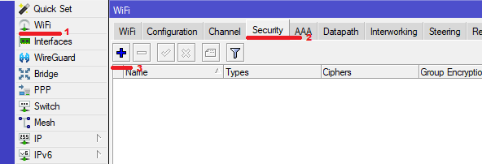

На вкладке Security указывается название профиля безопасности, разрешенные типы аутентификации и пароль для подключения к беспроводной сети. Переходим на вкладку FT и включаем настройки FT Enabled и FT Over DS. Это включает поддержку стандарта 802.11r, реализующего быстрый роуминг и перерегистрацию клиентов при перемещении между точками доступа, работающими в стандарте WiFi 6 AX.

Нажимаем ОК и переходим к созданию каналов под каждый спектр частот. Щелкаем на вкладку Channel и затем на +.

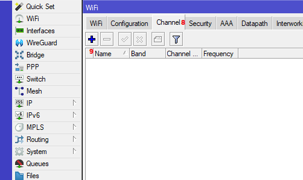

Для каждого диапазона частот, с которым мы будем работать, должен быть создан отдельный профиль. В нашем случае гибридная конфигурация, потому что есть устройства, которые работают как с диапазоном AC, так и с диапазоном AX. Соответственно нужно сделать профили каналов под спектры 2 GHz N, 5 GHz AC, 2 GHz AX, 5 GHz AX. По желанию можно вручную указать ширину канала и какие частоты использовать. Некоторые считают хорошей практикой для диапазона 2 GHz N указать частоты 2412 МГц, 2437 МГц и 2462 МГц (соответственно 1, 6 и 11 каналы). Мы не знаем какие каналы в конкретной локации будут заняты соседними сетями WiFi больше, какие меньше. Скорее всего, как раз 1, 6 и 11 будут наиболее перегружены, поэтому в нашем случае мы оставим выбор каналов на усмотрение Mikrotik. Если возникают проблемы, всегда можно будет зайти в профиль соответствующего канала и вручную прописать желаемую частоту, таким образом подобрав канал, на котором достигается наиболее стабильная связь.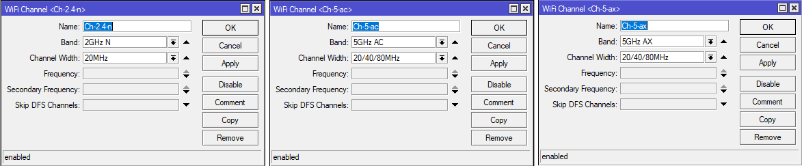

После настройки каналов имеем примерно такой вид: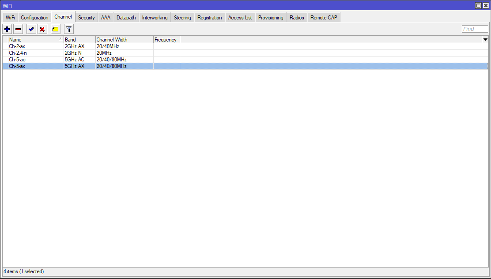

Далее необходимо создать конфигурации, которые будут передаваться точкам доступа в соответствии с их техническими возможностями. В нашем случае нужно создать конфигурации для радиомодулей, работающих в спектрах 2 GHz N, 5 GHz AC, 2 GHz AX, 5 GHz AX. Переходим на вкладку Configuration и нажимаем +.

На вкладке Configuration указываем понятное название конфигурации, режим работы – ap, название WiFi сети и фактическую страну расположения. От этого зависит какие частоты будут доступны к использованию. Далее переходим на вкладку Channel и выбираем профиль канала, созданный на предыдущем этапе. Далее на кладку Security и выбираем созданный ранее профиль безопасности. Обратите внимание! В новой версии Mikrotik CAPsMAN поле Datapath на контроллере остается пустым!После настройки всех допустимых конфигураций имеем следующий вид:

Далее переходим на вкладку Provisioning и нажимаем +. Здесь указываем какие конфигурации какому конкретно устройству будут отдаваться.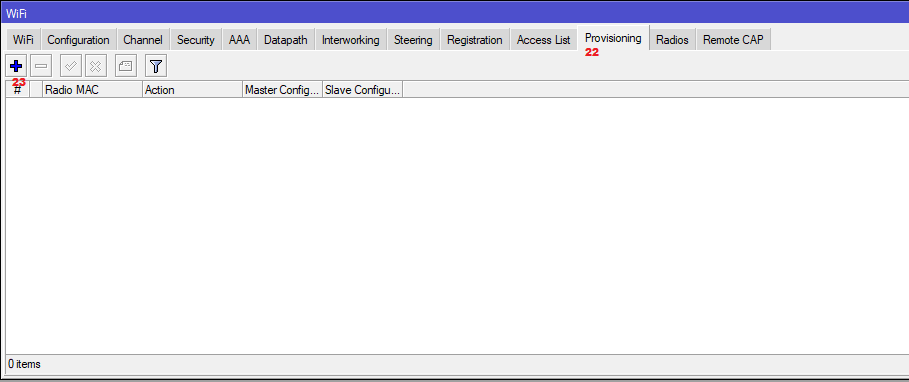

У нас 4 потенциальных диапазона, значит необходимо создать 4 правила. В поле Supported Bands указываем диапазон, поддерживаемый устройством, в поле Master Configuration выбираем под него конфигурацию, созданную на предыдущем этапе. В поле Action выбираем из списка create dynamic enabled (это создаст на контроллере динамический интерфейс при подключении точки доступа), в поле Name Format указываем формат имени, в котором будет представлено название виртуального интерфейса. %I означает, что в название интерфейса будет подставлено имя хоста точки доступа (название, указанное в неё в поле System -> Identity).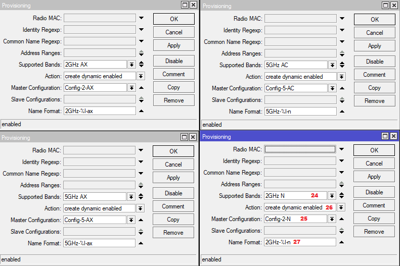

Делаем это для всех четырех диапазонов. После настройки таблица выглядит примерно так: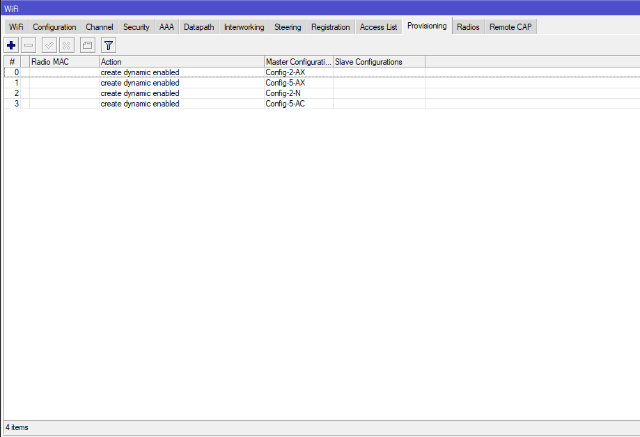

Последним этапом включаем сам контроллер CAPsMAN. Переходим на вкладку Remote CAP и кликаем на кнопку CAPsMAN.

В этом окне отмечаем пункт Enable и в поле Interfaces выбираем интерфейсы, через которые будет происходить управление точками доступа.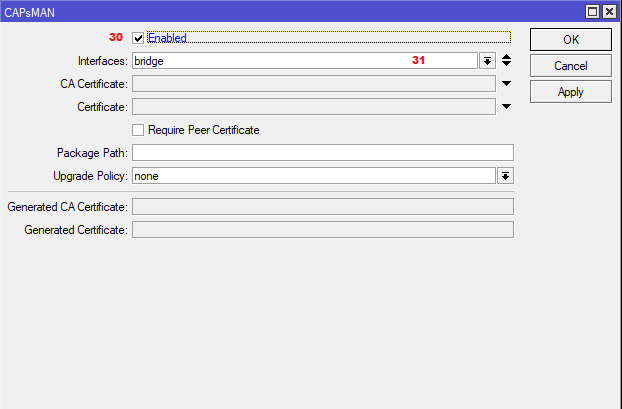

Если контроллер сконфигурирован на устройстве, не имеющем собственных WiFi модулей (например, RB3011), на этом настройка контроллера можно считать завершенной. Если же на нем есть собственные модули WiFi, необходимо сделать еще несколько манипуляций. Открыть раздел Bridge -> Ports и убедиться, что радиоинтерфейсы добавлены в требуемый бридж.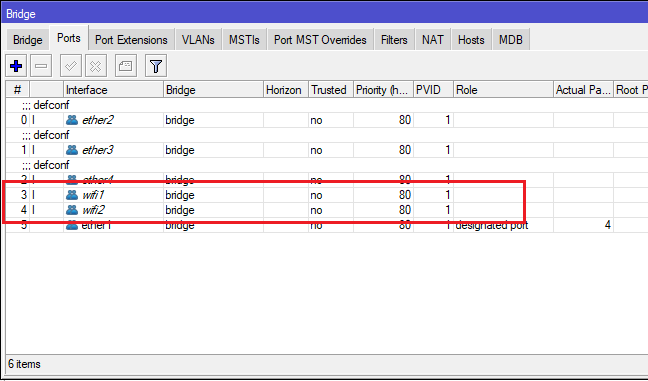

На момент написания статьи RouterOS не умеет конфигурировать свои интерфейсы через новый CAPsMAN, поэтому это необходимо сделать вручную. Чтобы узнать диапазон, на котором работает конкретный радиомодуль и назначить ему правильную конфигурацию, можно в разделе WiFi открыть вкладку Radios и посмотреть. Как правило, в AC устройствах интерфейс wifi1 будет работать с диапазоном 2 ГГц, а интерфейс wifi2 с диапазоном 5 ГГц. В AX устройствах напротив: wifi1 будет работать с 5 ГГц диапазоном, а wifi2 с 2 ГГц.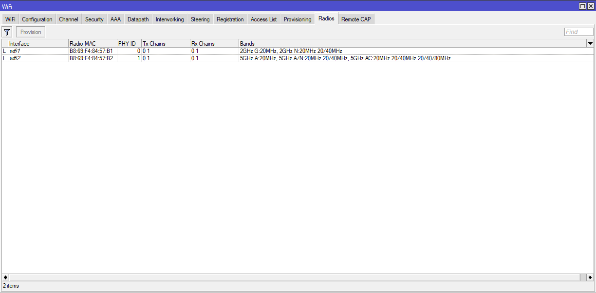

Наш контроллер настраивается на маршрутизаторе hAP AC^2, соответственно интерфейс wifi1 у него 2 гигагерцовый. Открываем раздел WiFi, дважды щелкаем мышкой на каждом интерфейсе и настраиваем.

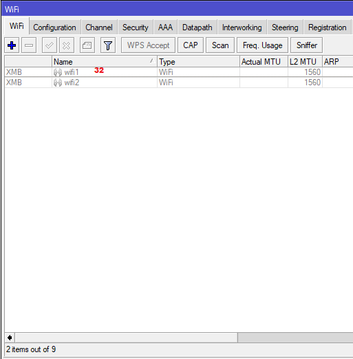

На вкладке Configuration выбираем созданную выше конфигурацию в соответствии с нашим радиомодулем и в поле Manager указываем local. На вкладке Channel выбираем подходящий профиль канала. На вкладке Security выбираем подходящий профиль безопасности.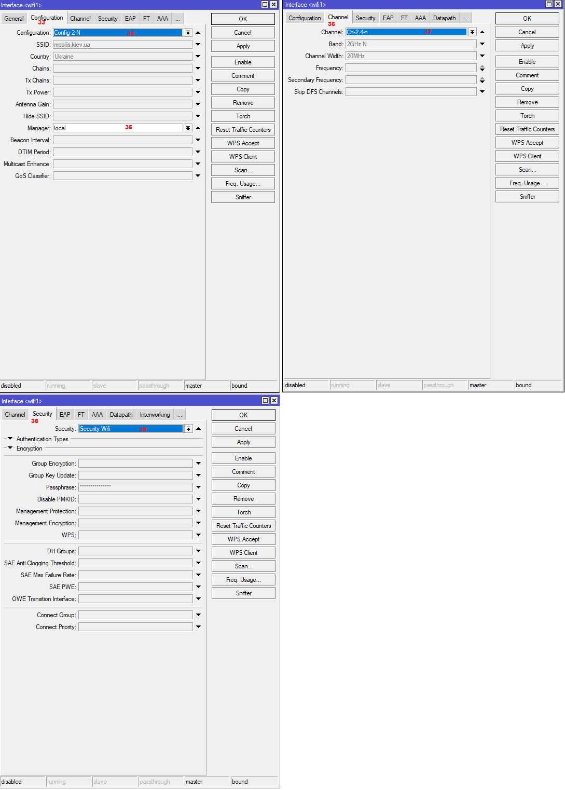

После настройки выбираем мышкой оба модуля и нажимаем Enable. Если все сделано правильно, модули включатся и начнут раздавать WiFi.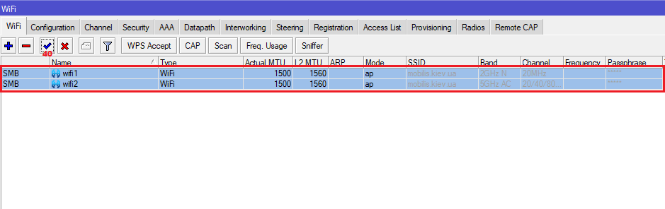

На этом настройка контроллера завершена.

* ###### Настройка точек доступа

Самый простой способ – это сброс настроек в режиме CAPS. В таком случае устройство полностью очистит существующую конфигурацию и автоматически применит необходимые настройки для подключения к контроллеру Mikrotik CAPsMAN. Будет автоматически создан бридж, добавлены в него все интерфейсы, включая wifi, на этом же бридже будет запущен DHCP клиент, а в настройках WiFi интерфейсов в поле Manager будет стоять значение capsman. Также будет создан и назначен Slaves Datapath. Чтобы выполнить это, необходимо выбрать пункты меню System -> Reset Configuration, отметить опцию CAPS Mode и нажать кнопку Reset Configuration.

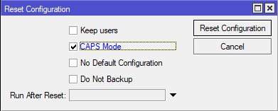

Будьте внимательны! В этом случае будет потеряна вся текущая конфигурация устройства, поэтому на всякий случай обязательно сделайте резервную копию! Если по каким-либо причинам сброс устройства невозможен, или есть желание вручную все настроить, нужно выполнить следующее. Сначала убедиться, что WiFi интерфейсы добавлены в бридж. Если нет – добавить.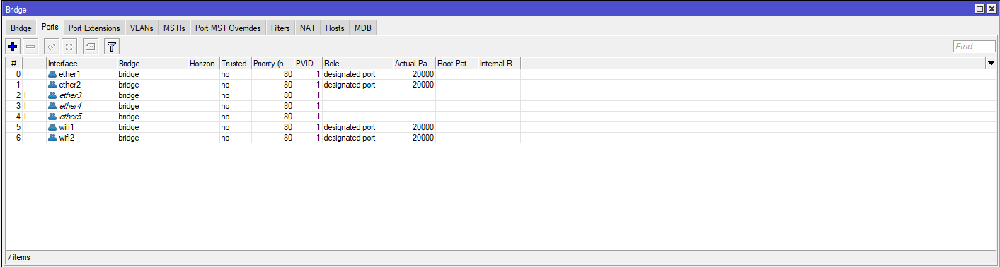

После этого в разделе WiFi на каждом интерфейсе щелкнуть мышкой, перейти на вкладку Configuration и в поле Manager выбрать Capsman.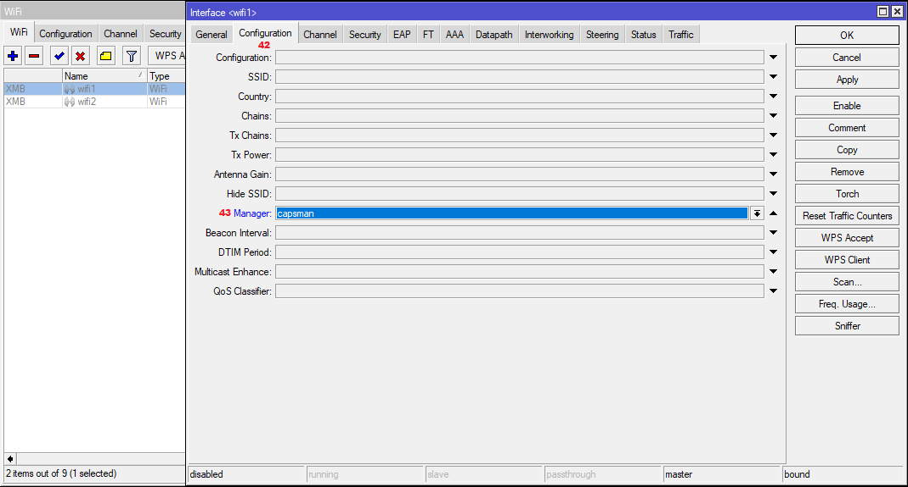

Далее выбрать оба интерфейса, щелкнуть кнопку Enable.

После этого создать Datapath (на клиенте это необходимо делать). В этом же окне перейти на вкладку Datapath, щелкнуть +. В новом окне указать название Datapath и выбрать бридж.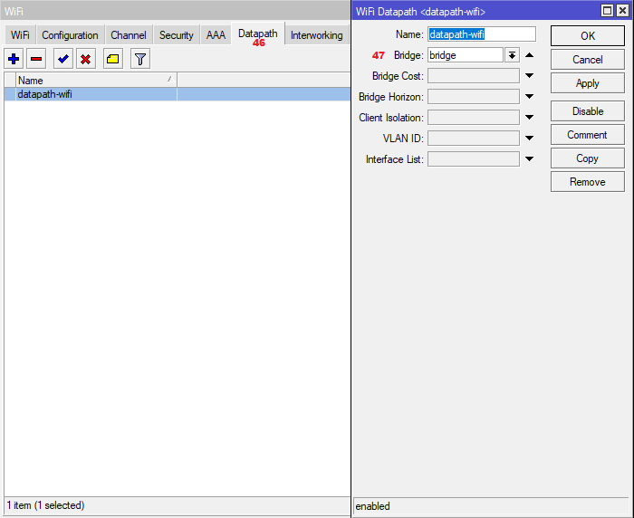

После создания Datapath снова вернуться на вкладку Wifi и нажать кнопку CAP. В открывшемся окне отметить опцию Enable, выбрать Discovery Interfaces, где точка будет искать контроллер Mikrotik CAPsMAN, или явно указать IP-адрес контроллера в поле CAPsMAN Addresses. Внизу в поле Slaves Datapath выбрать из списка Datapath, созданный на прошлом этапе.

Через несколько секунд после нажатия ОК точка доступа должна подключиться к контроллеру, получить конфигурацию и начать раздавать WiFi.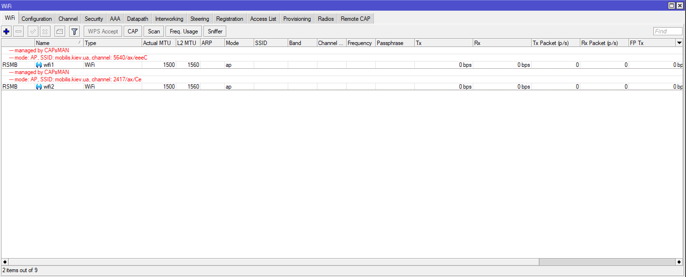

На этом настройка CAPS на точке завершена. На контроллере, в разделе WiFi, должны появиться интерфейсы, получившие конфигурацию. Наша точка доступа имеет System Identity «hAP AX», поэтому в соответствии с правилами, созданными в разделе Provisioning, ее интерфейсы получили названия 2GHz-hAP AX-ax и 5GHz-hAP AX-ax.

Также на контроллере в разделе Registration можно увидеть какой WiFi клиент к какой точке доступа подсоединен. В нашем случае мы видим, что одно устройство подсоединено к 5 ГГц модулю непосредственно на контроллере, другое устройство зарегистрировано на управляемой точке доступа и использует диапазон 2 ГГц.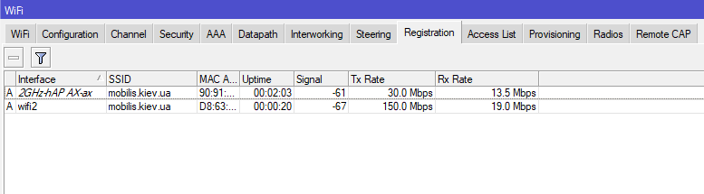

После подтверждения успешного взаимодействия контроллера и точек доступа хорошей практикой будет защитить наши точки от несанкционированного изменения посторонними контроллерами или подсоединения сторонних устройств к нашей конфигурации. Для этого сначала на точке доступа в разделе WiFi нажать кнопку CAP и в поле Certificate выбрать request и нажать Apply.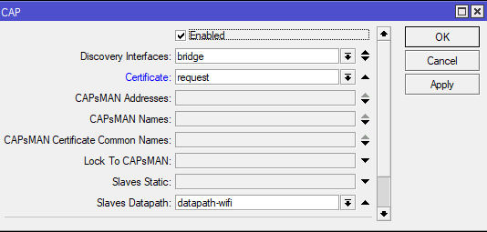

Точка доступа получит сертификат от контроллера и его необходимо выбрать из списка.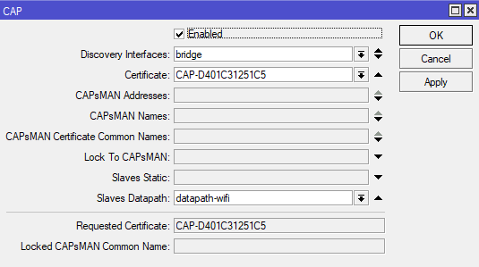

Затем на контроллере в разделе WiFi на вкладке Remote CAP включить опцию Require Peer Certificate и в поле Upgrade Policy выбрать suggest same version. Если выбрать вариант require same version, точка доступа не сможет присоединиться к контроллеру, если версия RouterOS отличается от версии на контроллере.

На этом настройку Mikrotik CAPsMAN можно считать законченной. Конечно, здесь не описаны различные сопутствующие настройки, которые необходимо произвести при конфигурировании RouterOS, такие как: изменение паролей/пользователей, отключение сервисов, которыми не планируем пользоваться, отключение MAC Telnet сервера на ненужных интерфейсах, настройка правил файрвола и т.д.