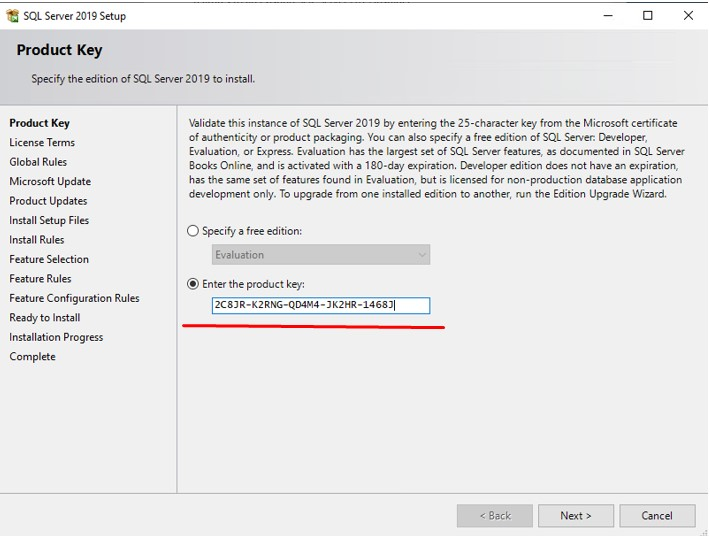
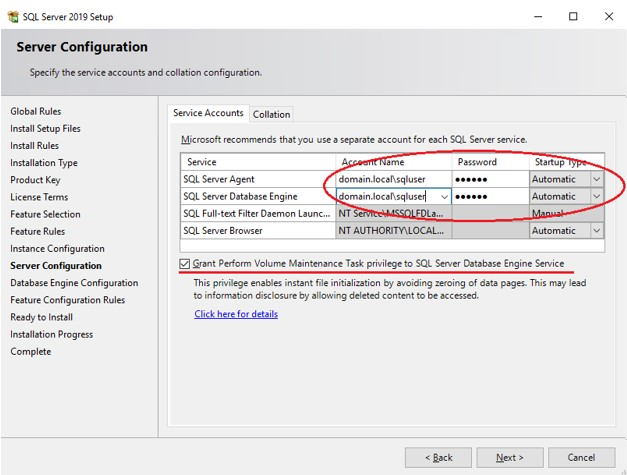
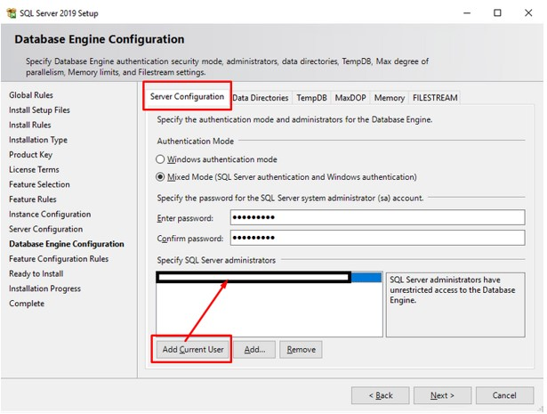
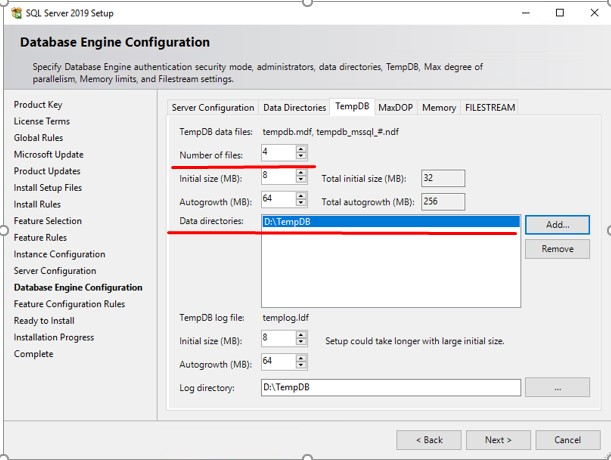
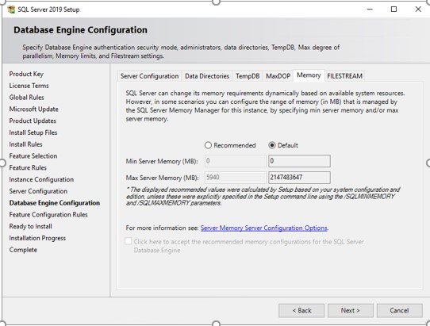

# Как установить SQL Server 2019 для работы с 1С

Одной из самых распространённых и популярных до сих пор остается MS SQL Server. Неудивительно, что архитектура 1С Предприятия уже давно плотно связана именно с этой СУБД. Установка SQL Server довольно тривиальна и особых сложностей не представляет. Однако, трудности обязательно появятся в будущем, если на этом первом этапе администратор допустит оплошность. Вот для того, чтобы такого не случилось, я и помогу вам этого избежать.

Для начала — какую версию MS SQL выбрать для наших целей? Прежде всего не забываем, что работать наша СУБД будет с 1С, будет скорее всего не один год, а потому стабильность и безопасность ее должна быть на первом месте. Понятное дело, что устанавливать устаревшую версию никакого смысла не имеет. Но какую же выбрать? Тут нам приходит на помощь так называемый жизненный цикл или lifecycle приложения. Что же говорит об этом создатель приложения MS SQL Server — корпорация Microsoft? Очевидно, что на данный момент (осень 2024 года) актуальными остаются версии MS SQL Server 2016, 2017, 2019 и 2022 версий. Какую же выбрать? А это уже зависит от версии операционной системы, установленной на вашем сервере.

Наиболее оптимальным как по продолжительности жизненного цикла, так и по рекомендуемой ОС я считаю версию MS SQL Server 2019. Самую свежую версию 2022 рассматривать не будем — слишком она свежая. Ну а версии 2016-2017 скоро прекратят свой жизненный цикл. А мы тут на долгие годы замахнулись! Потому остается версия 2019. Именно ее установку мы и рассмотрим в дальнейшем. Свой выбор я никому не навязываю, просто я так считаю.

В любой версии СУБД производитель предлагает различные редакции, в зависимости от целей использования и количества денег, которые готовы на нее потратить. Конечно же ни в коем случае мы не будем пользоваться пиратской версией американского продукта, потому знать, чем различаются редакции нам просто позарез как нужно.

Для самых пытливых вот пожалуйста:

* Express является бесплатной для использования редакцией. Функционал довольно ограничен, самое ощутимое ограничение экспресс версии — максимальный размер базы 10 ГБ. Эта редакция подойдет для небольших проектов, например, студенческих работ или для обучения SQL/T-SQL.
* Standard это полноценная платная редакция, но многих функций всё еще нет. Максимальный объём оперативной памяти, который сможет использовать SQL Server – 128 ГБ, также отсутствуют группы доступности AlwaysOn и другие компоненты. Standard предназначен для приложений в небольших организациях.
* Enterprise включает в себя все возможные функции и компоненты, никаких ограничений нет. Корпоративная редакция обычно используется крупными корпорациями или компаниями, которым необходим функционал этой версии.
* Developer редакция так же как и Enterprise не имеет никаких ограничений и её можно использовать бесплатно, но она может использоваться только для разработки и тестирования приложений.
* Web редакция почти ничем не отличается от standard, кроме как более сильными ограничениями в функционале и соответственно более низкой стоимости лицензирования;
* Evaluation — ознакомительная редакция SQL Server, которая предоставляет полный функционал Enterprise и работает в течении 180 дней (может быть обновлена до полноценной версии).
## Загрузка MS SQL Server
Загрузить дистрибутив MS SQL Server можно с сайта загрузок Microsoft. Для этого надо перейти по адресу https://www.microsoft.com/en-us/sql-server/sql-server-downloads и выбрать нужную редакцию для загрузки. С сайта загрузится веб-инсталлятор, с помощью которого можно либо сразу запустить установку, либо загрузить полный дистрибутив. После этого проверить список обновлений и при необходимости загрузить наиболее свежее.
## Установка MS SQL Server
Монтируем образ с дистрибутивом и запускаем установщик (файл setup).

В открывшемся окне переходим на вкладку Installation и выбираем пункт меню New SQL Server stand-alone installation or add features to an existing installation (установка обычного изолированного экземпляра).

Выбираем редакцию, которую будем устанавливать или можно ввести имеющийся ключ продукта, который и определит устанавливаемую редакцию:

Переходим далее и соглашаемся с лицензионным соглашением.

На следующей странице не проверяем наличие обновлений – отметку не ставим, а просто нажимаем «Далее»

После этого выбираем компоненты SQL Server, которые будем устанавливать. 1С не использует большинство механизмов SQL-сервера и если мы не собираемся их использовать для иных целей, то оставляем только Службы ядра СУБД и Соединения с клиентскими средствами (**Database Engine Services** и **Client Tools Connectivity**). Первый — сам движок SQL Server, обязательный к установке, второе — клиентские компоненты, предназначенные для обеспечения связи между клиентами и серверами (у нас же будет клиент-серверная архитектура 1С).

Если установщик не обнаружит никаких проблем, то переходим к следующему этапу — выбору экземпляра (Instance) SQL Server. На одну операционную систему можно установить до 50 экземпляров SQL Server. Для того, чтобы как-то их различать, первый экземпляр называется экземпляром по умолчанию (Default Instance) с именем MSSQLSERVER, остальные называются именованными (Named Instance) и для них надо придумывать уникальное имя.

Далее — на закладке Учетные записи служб можно установить флаг **Предоставить право на выполнение задач обслуживания тома службе ядра СУБД SQL Server**. Эта галочка включает функцию мгновенной инициализации файлов (Instant File Initialization). На самом деле тут палка о двух концах – ее включение позволяет сократить время выполнения некоторых операций и снизить нагрузку на дисковую подсистему, но при этом снижает безопасность. Так, пользователь, которому назначено право на выполнение задач обслуживания тома, может удалить том, что приведет к потере данных, либо создать задачу обслуживания диска для изменения данных на нем. Обычно специалисты по информационной безопасности не рекомендуют включать эту функцию.

**Обязательно** следует поменять режим запуска службы агента (SQL Server Agent) на Auto. Агент SQL Server — служба Microsoft Windows, выполняющая запланированные задачи администрирования, о которых расскажу в будущем.

Затем **обязательно** проверим параметры сортировки на второй вкладке. Если правильно настроены региональные настройки ОС, то скорее всего там ничего изменять не придется, но желательно лишний раз убедиться, что там установлено Cyrillic\_General\_CI\_AS.

Следующее окно – настройка собственно ядра нашей СУБД. Здесь тоже есть несколько важных моментов.

Рекомендую выбрать смешанный режим проверки подлинности и задать пароль суперпользователю SQL — sa. Также ниже указать администраторов данного экземпляра SQL-сервера, как вариант хотя бы добавить текущего пользователя, но если администрировать данный экземпляр будут другие коллеги, то имеет смысл сразу их указать.

На вкладке «Каталоги данных» обязательно нужно указать в качестве места хранения пользовательских баз место на производительном массиве или отдельном диске. Здесь же сразу можно указать каталог для хранения резервных копий.

В отдельной закладке TempDB содержатся настройки одноименной базы. Здесь выставляем для базы: количество файлов — 4, начальный размер — от 1 ГБ до 10 ГБ, авторасширение — 512 МБ, аналогичный размер и авторасширение устанавливается для файла журнала. Также не забываем проконтролировать размещение TempDB на отдельном разделе/диске.

Перейдем на вкладку MaxDOP. На многопроцессорном компьютере при выполнении запроса SQL Server  может использовать параллелизм, или, говоря проще – выполнять один запрос в несколько потоков. Параметр MaxDOP (Max Degree of parallelism) как раз отвечает за параллельную обработку данных и определяет максимальное число процессоров, применяемых при выполнении одного запроса.

Параметр MaxDOP определяется редакцией SQL Server, типом процессора и операционной системой. Чтобы разрешить серверу самому определять максимальную степень параллелизма, установите 0 в качестве значения данного параметра. И наоборот, для отключения многопоточности присваивают параметру значение 1. Для работы с 1С как раз рекомендуют отключать многопоточность.

Следующая вкладка – память. В новой версии SQL Server необходимые значения для работы экземпляра можно задавать в процессе его установки, а не после. Как это сделать? Придётся немного посчитать. За основу расчетов берём объем выделенного SQL-серверу размера памяти (RAM). Это вся оперативная память оборудования, кроме 8ГБ на нужды операционной системы. Для минимального объема памяти указываем половину RAM. Для максимального – полный объем RAM за исключением 1Гб на каждые 16Гб (RAM — 1024 \* RAM/16384). Если лень считать, оставляйте значения по умолчанию.

На вкладке FILESTREAM можно включить технологию потокового доступа к данным. По умолчанию функционал FILESTREAM отключен, таким мы его и оставим.

Завершив настройки жмем Next и переходим к финальной части установки. Здесь мы можем проверить настройки и при необходимости вернуться назад и поправить их. Наконец-то, запускаем установку и дожидаемся ее успешного (я надеюсь) завершения.

Ну вот как-то так. Если все у вас получилось, то можно принимать поздравления — вы научились устанавливать MS SQL Server 2019.