# Резервное копирование и восстановление базы данных в MS SQL Server

В этой статье мы рассмотрим, как настроить резервное копирование баз данных в Microsoft SQL Server, покажем, как восстановить базу данных из резервной копии с помощью SQL Server Management Studio и Transact-SQL. Первая часть статьи посвящена теоретическим аспектам резервного копирование в SQL, во второй на примере мы покажем, как настроить регулярное резервное копирование базы данных MS SQL с помощью плана обслуживания и восстановить базу из резервной копии на примере [установленного Microsoft SQL Server 2019](https://winitpro.ru/index.php/2020/01/15/guide-ustanovka-ms-sql-server-best-practices/).

Требования к плану резервного копирования баз данных SQL Server устанавливает бизнес, учитывая несколько критериев:

* Допустимый объём потерянных данных (за последний день/час/минуту/секунду);
* Требования к дисковому пространству и его стоимость;
* Затраты ресурсов сервера на резервное копирование.

Следует понимать, что с помощью механизмов резервного копирования невозможно добиться резервирования данных в реальном времени. Для этой цели используются другие технологии [высокой доступности](https://winitpro.ru/index.php/2020/01/28/vysokaya-dostupnost-dannih-mssql-server/) SQL Server – [группы доступности Always On](https://winitpro.ru/index.php/2020/02/03/nastrojka-always-on-mssql-server/), зеркалирование баз данных или [репликация](https://winitpro.ru/index.php/2020/02/13/nastrojka-replikacii-v-sql-server/).

Содержание:

* [Типы резервного копирования SQL Server](#sql-server)
* [Модели восстановления базы данных SQL Server](#sql-server_1)
* [Настройка резервного копирования SQL Server с помощью плана обслуживания](#sql-server_2)
* [Восстановление базы данных SQL Server из резервной копии](#sql-server_3)

## Типы резервного копирования SQL Server

### Полное (Full Backup)

Полное резервное копирование делает копию всей базы данных, включая все объекты и данные системных таблиц. Полная резервная копия не будет усекать (truncate) журнал транзакций. Это основной тип резервных копий, который требуется выполнять перед другими типами резервных копий.

Полную резервную копию вы можете восстановить за 1 шаг, так как она не требует других дифференциальных/инкрементальных копий.

Если модель восстановления базы SQL данных установлена как “Полная”, то при восстановлении бекапа вы можете указать параметр “**STOPAT**”, где указывается время (до секунды) на котором нужно остановить восстановление данных. Например, сотрудник внёс некорректные данные в 14:46:07, с помощью параметра STOPAT вы можете восстановить данные на момент 14:46:06

### Дифференциальное

Дифференциальное или разностное резервное копирование — это копирование только тех данных, которые появились с момента последней полной резервной копии.

Данный тип резервного копирования используют совместно с полной резервной копией, так как для восстановления дифференциальной копии необходима полная резервная копия.

Обычно при использовании разностного резервного копирования используют план по типу “полное раз в N дней, дифференциальное каждые N часов”. Если ежедневный оборот данных достаточно высокий, то данный тип резервных копий может быть неудобен в применении, так как копии будут весить довольно много.

Например, если полная резервная копия весит 300 GB, а дифференциальная спустя час работы 5 GB, то спустя сутки это будет 120 GB, что делает использование данного типа копий нерациональным.

### Журнал транзакций

Резервное копирования журнала транзакций копирует все транзакции, которые произошли с момента последнего резервного копирования, а затем урезает журнал транзакций для освобождения дискового пространства.

Восстанавливая журнал транзакций, вы также можете указать параметр STOPAT, как и в восстановлении полной резервной копии.

Этот тип бекапа является инкрементальным, поэтому для восстановления базы данных вам потребуется вся цепочка резервных копий: Полная и все последующие инкрементальные журнала транзакций.

### Tail-Log

Этот вид резервного копирования выделяют как отдельный, но фактически это обычная резервная копия журнала транзакций с NORECOVERY опцией.

Tail-Log бекап рекомендуется делать перед восстановлением копий журнала транзакций, чтобы не потерять транзакции между последним бекапом и текущим моментом времени.

### Copy-only

Этот вид бекапа не может служить “базой” для дифференциальных резервных копий и для копий журнала транзакций. Copy-only бекап не нарушает текущую цепочку резервных копий (полный-> дифференциальный или полный -> копии журналов транзакций) и используется только в том случае, если вам нужно снять полную резервную копию, не задевая текущую цепочку бекапов.

За исключением этих нюансов – ничем не отличается от обычной полной копии.

### Частичная резервная копия

Partial backup этот тип резервной копии используется для того, чтобы снять копии с read-only файловых групп. На практике используется редко.

### Резервное копирование файлов и файловых групп

Используется для снятия резервных копий определенных файлов или файловых групп.

## Модели восстановления базы данных SQL Server

Модель восстановления – это параметр базы данных SQL Server, который отвечает за регистрацию транзакций в журнале транзакций. Всего существует три модели восстановления:

### Простая модель восстановления

Автоматически урезает журналы транзакций, освобождая место на диске. Вручную журналы транзакций обслуживать не нужно.

В случае аварии, данные могут быть восстановлены только на момент снятия резервной копии.

При использовании этой модели восстановления, следующий функционал SQL Server недоступен:

* Доставка журналов транзакций
* Always On
* Point-In-Time восстановление
* Резервные копии журнала транзакций

### Полная модель восстановления

Полная модель восстановления хранит все транзакции в журнале транзакций до усечения журнала (посредством снятия резервной копии журнала).

Это самая “надежная” модель восстановления, при аварийном сбое можно вы сможете восстановить все транзакции, кроме тех, которые не успели завершиться при аварии.

Эта модель нуждается в обслуживании журналов транзакций (регулярные резервные копии), иначе журналы займут всё дисковое пространство.

### Восстановление с неполным протоколированием (bulk logged)

Эта модель, также, как и полная, записывает все транзакции в журнал транзакций, за исключением таких операций как:

* SELECT INTO
* BULK INSERT и BCP
* INSERT INTO SELECT
* Операции с индексами (CREATE INDEX, ALTER INDEX REBUILD, DROP INDEX)

В остальном эта модель работает аналогично полной модели восстановления.

## Настройка резервного копирования SQL Server с помощью плана обслуживания

Планы обслуживания SQL Server это самый распространенный способ настройки регулярного резервного копирования.

Рассмотрим настройку резервного базы данных на SQL Server копирования по плану:

* Полная резервная копия каждые 24 часа
* Копия журнала транзакций – каждые 30 минут

В SSMS (SQL Server Management Studio) перейдите в раздел Management -> Maintenance Planes и запустите -> мастер создания плана обслуживания (Maintenance Plan Wizard).


Укажите имя плана и выберите режим “Separate schedules for each task”.

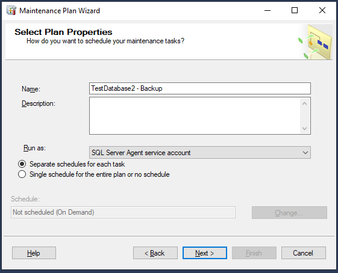

Выберите операции, которые нужно сделать в этом плане обслуживания:

* Back Up Database (Full)
* Back Up Database (Transaction Log)

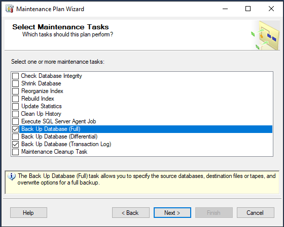

Используйте следующую последовательность операций:

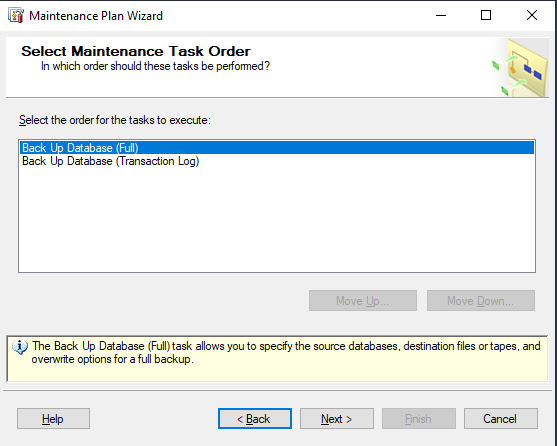

Выберите базу данных SQL Server, которую нужно бэкапить и выберите расписание.


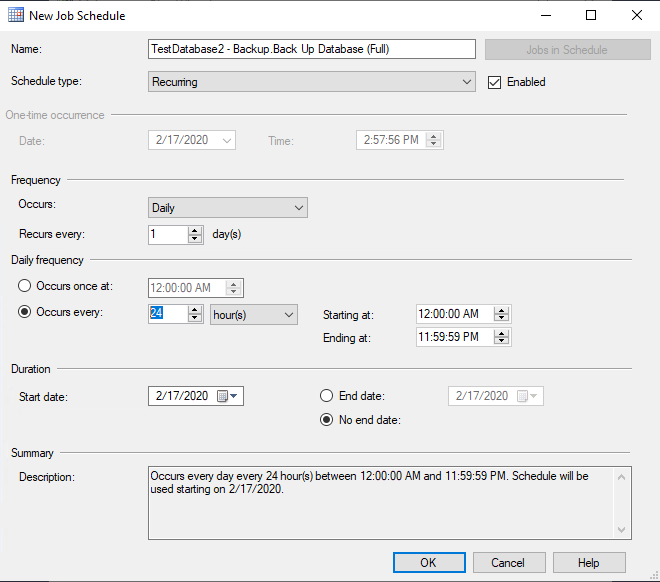

Укажите путь к каталогу, в который нужно сохранять резервные копию ваше базы данных.

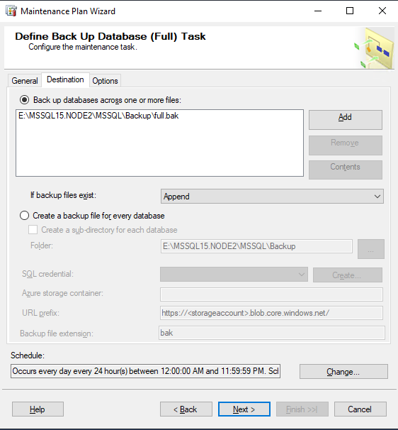

Укажите сколько будут храниться резервные копии (например, 14 дней).

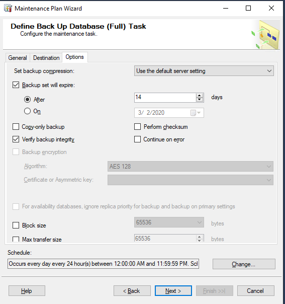

Нажмите Next и аналогично создайте расписание резервного копирования для журнала транзакций.


Опционально можно указать файл для ведения лога плана обслуживания.


Завершение настройки плана обслуживания SQL Server.


Выполните план обслуживания вручную и проверьте журнал.

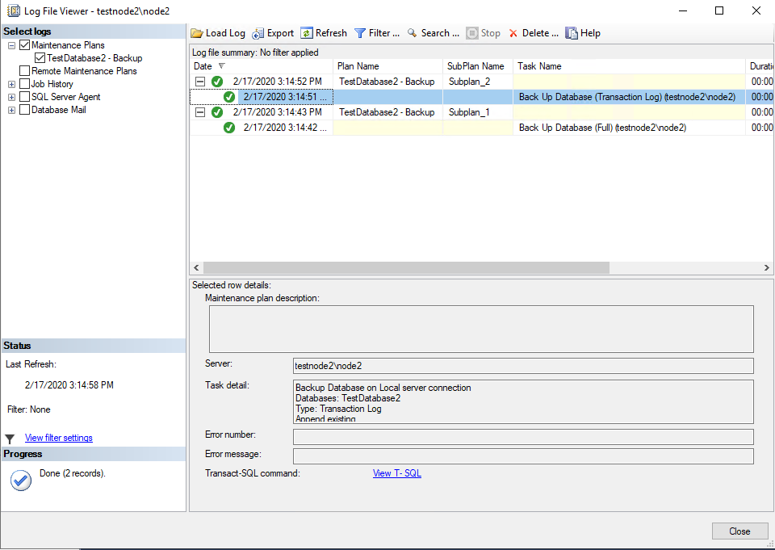

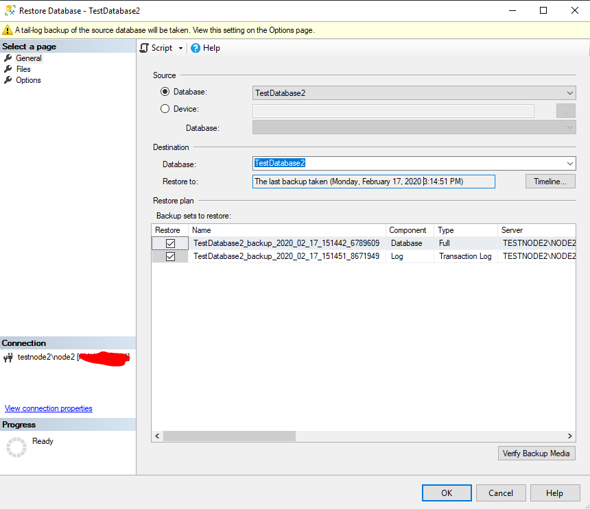

Как вы видите была создана полная резервная копия базы данных SQL Server и следом копия журнала транзакций. На этом настройка резервного копирования закончена.

## Восстановление базы данных SQL Server из резервной копии

Теперь рассмотрим, как восстановить базы данных SQL Server из резервной копии. Для восстановления базы можно использовать графическую консоль SQL Server Management Studio или язык T-SQL.

### Восстановление резервной копии с помощью SQL Server Management Studio

Запустите SSMS, щелкните по разделу Database и выберите пункт Restore Database.

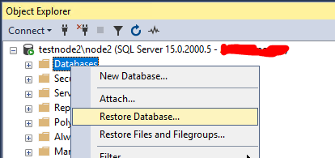

Выберите базу данных. В окне появится список резервных копий, зарегистрированных в SQL Server для этой базы данных.

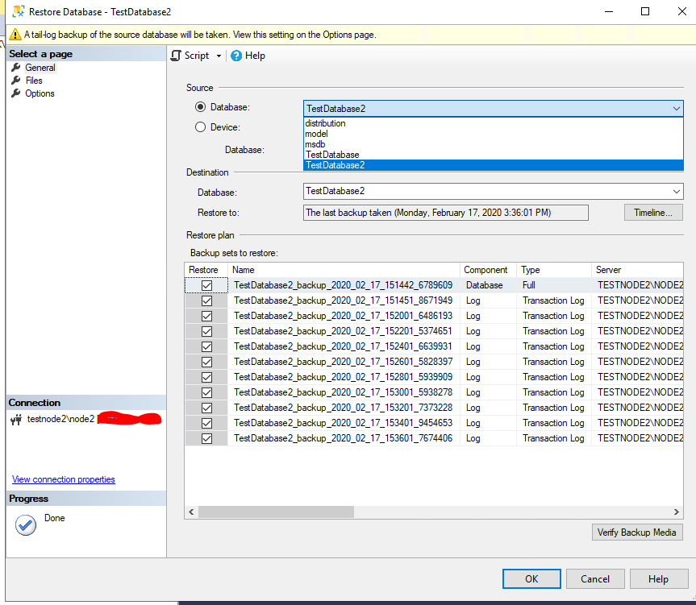

Для примера, воспользуемся Point-In-Time восстановлением и выберем момент, на который мы хотим восстановить базу данных. Нажмите Timeline.


Выберите опцию “**Close existing connections to destination database**”, если ваша база данных находится в статус Online

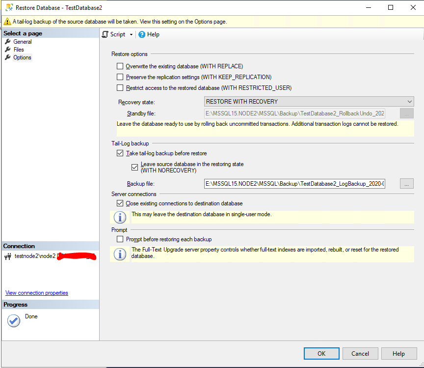

Нажмите ОК. После этого база данных восстановится на выбранный момент времени.

### Восстановление базы данных MS SQL Server с помощью T-SQL

Рассмотрим небольшой Transact-SQL скрипт, который выполняет ту же последовательность действия для восстановления базы данных, что и мастер (скрипт был сгенерирован мастером из примера выше).

``` ps1
USE [master]  
ALTER DATABASE [TestDatabase2] SET SINGLE_USER WITH ROLLBACK IMMEDIATE  
BACKUP LOG [TestDatabase2] TO DISK = N'E:\MSSQL15.NODE2\MSSQL\Backup\TestDatabase2_LogBackup_2020-02-17_15-39-43.bak' WITH NOFORMAT, NOINIT, NAME = N'TestDatabase2_LogBackup_2020-02-17_15-39-43', NOSKIP, NOREWIND, NOUNLOAD, NORECOVERY, STATS = 5  
RESTORE DATABASE [TestDatabase2] FROM DISK = N'E:\MSSQL15.NODE2\MSSQL\Backup\full.bak' WITH FILE = 1, NORECOVERY, NOUNLOAD, STATS = 5  
RESTORE LOG [TestDatabase2] FROM DISK = N'E:\MSSQL15.NODE2\MSSQL\Backup\trans.bak' WITH FILE = 1, NORECOVERY, NOUNLOAD, STATS = 5  
RESTORE LOG [TestDatabase2] FROM DISK = N'E:\MSSQL15.NODE2\MSSQL\Backup\trans.bak' WITH FILE = 2, NOUNLOAD, STATS = 5, STOPAT = N'2020-02-17T15:38:23'  
ALTER DATABASE [TestDatabase2] SET MULTI_USER  
GO
```

В данном случае база данных переводится в **SINGLE\_USER**, но нужно быть аккуратным с этим параметром, так как в некоторых ситуациях вы можете закрыть себе доступ, если кто-то откроет сессию раньше вас.

Дальше выполняется tail-log бекап, затем восстанавливается полный бекап и следом восстанавливаются бекапы журнала транзакций. Обратите внимание на параметр STOPAT, база данных восстановиться на момент 15:38:23

# Рекомендации и best practice по резервному копированию SQL Server

* **Резервные копии не должны храниться на том же диске, что и ваш SQL Server**. Это правило касается любых резервных копий. При выходе из строя основного дискового массива вы должны иметь доступ к вашим резервным копиям. Если позволяют ресурсы, лучше хранить резервные копии сразу на нескольких разрозненных массивах.
* **Процесс резервного копирования должен минимально влиять на работу пользователей**. Полные резервные копии лучше делать тогда, когда пользовательская активность на сервере минимальна.
* **Регулярно проверяйте целостность резервных копий и проводите тестовые восстановления**. Вы всегда должны быть уверены, что ваши бекапы валидны и готовы к восстановлению в любое время.
* **Заранее рассчитайте время, необходимое для полного восстановления при аварии**. Часто в базах хранится критически важная для бизнеса информация, поэтому ваш руководитель должен знать минимальное время, которое потребуется для восстановления после аварии. Если даже вас об этом не спрашивают, лучше заранее уведомить об этом, чтобы в случае аварии не возникло недопонимания.