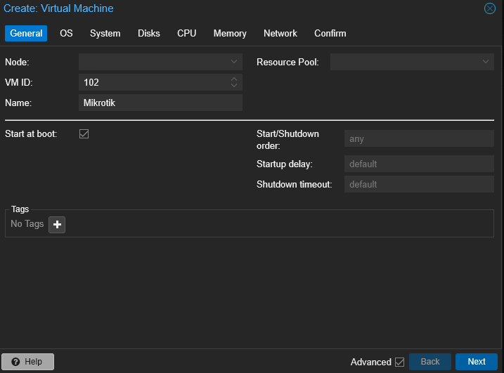
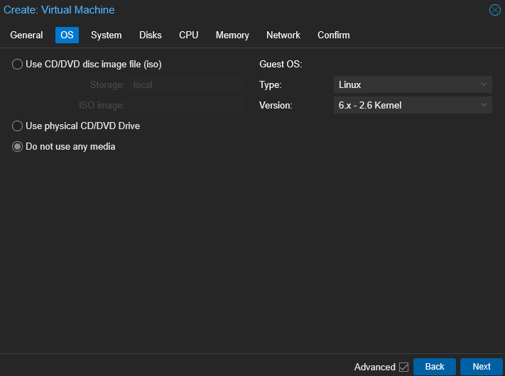
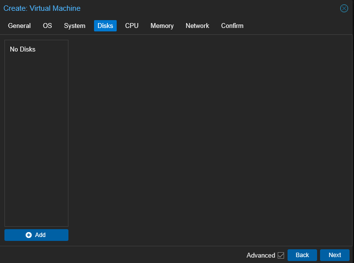
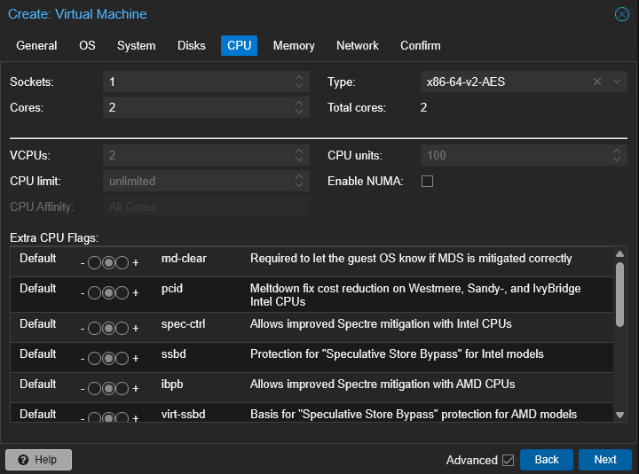
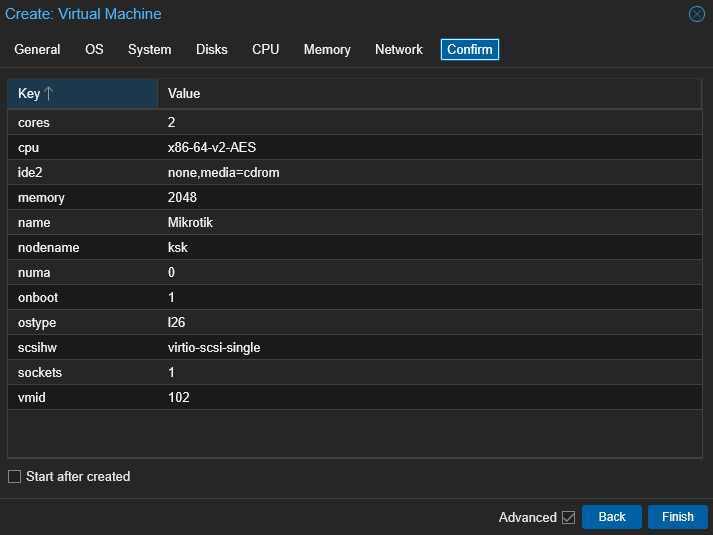
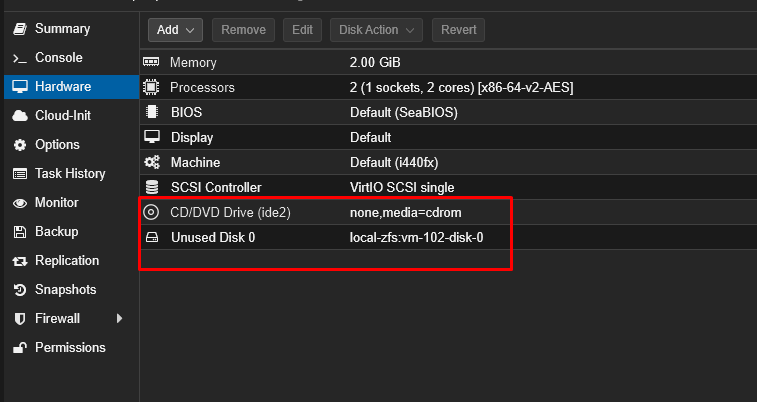
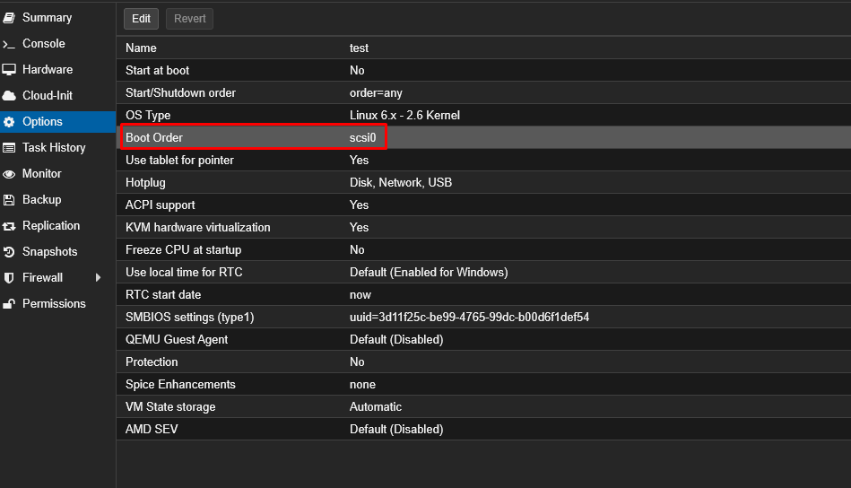

# Установка Mikrotik CHR на Proxmox

## Шаг 1: Создаем Виртуалку для Mikrotik CHR

<figure markdown="span">
  
</figure>
Даем имя виртуалке и ставим галочку запускать при старте  Proxmox
<figure markdown="span">
  
</figure>
Создаем без ОС
<figure markdown="span">
  
</figure>
Оставляем по дефолту 
<figure markdown="span">
  
</figure>
Удаляем диск 
<figure markdown="span">
  
</figure>
Ставим нужное количество ядер
<figure markdown="span">
  
</figure>
Ставим нужное количество ОЗУ
<figure markdown="span">
  
</figure>
Создаем без сетывых интерфейсов 
<figure markdown="span">
  
</figure>
Прмерно такой конфиг получаем пустой ВМ для 

## Шаг 2: Скачаем образ диска Mikrotik CHR
Переходим во временую папку, скачиваем и распаковуем архив
```
cd  /root/temp
wget https://download.mikrotik.com/routeros/7.20.2/chr-7.20.2.img.zip
apt install unzip
unzip chr-7.20.2.img.zip
```
## Шаг 3: Расширяем образ диска Mikrotik CHR
Расширяем на нужный объем образ диска Mikrotik CHR
```
qemu-img resize -f raw chr-7.20.2.img 1G
```
## Шаг 4: Делаем ипорт образ диска Mikrotik CHR
```
qm disk import 102 chr-7.20.2.img local
```
**102** - это ID виртулки куда делаем импорт 
**chr-7.20.2.img** - это образ диска 
**local** - Это имя хранилища дисков на Proxmox

## Шаг 5: Делаем правки виртуалки для запуска Mikrotik CHR
Удаляем **CD/DVD** и добавляем наш диск (Unused Disk)
<figure markdown="span">
  
</figure>
<figure markdown="span">
  
</figure>
Добавляем Сетевые инрфейсы VMBR0(WAN) и VMBR1(LAN)

В разделе "Options" задать загрузку с нашего образа 
<figure markdown="span">
  
</figure>

## Шаг 6: Запускаем виртуалкиу Mikrotik