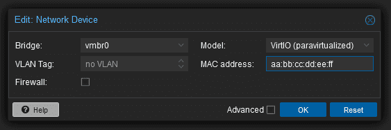
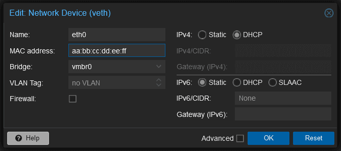
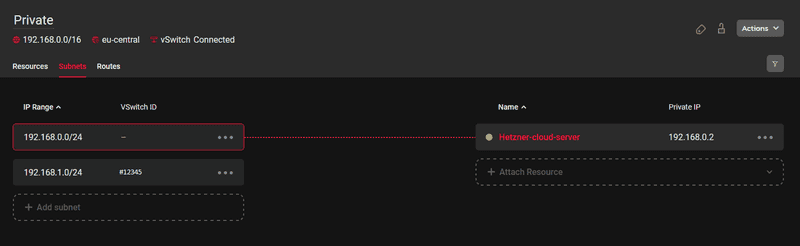

# Настройка сети Proxmox

Включить IP-пересылку на хосте
При маршрутизации мосты ( vmbr0 например, ) не подключены к физическому интерфейсу. Вам необходимо активировать пересылку IP-пакетов на хост-системе. Обратите внимание, что пересылка пакетов между сетевыми интерфейсами отключена в стандартной установке Hetzner. Чтобы обеспечить постоянную пересылку IP-пакетов после перезагрузки, используйте следующие команды:

* Для IPv4 и IPv6
!!! abstract "Команда"
    ``` linux-config
    sed -i 's/#net.ipv4.ip_forward=1/net.ipv4.ip_forward=1/' /etc/sysctl.conf
    sed -i 's/#net.ipv6.conf.all.forwarding=1/net.ipv6.conf.all.forwarding=1/' /etc/sysctl.conf
    ```

* Примените изменения
!!! abstract "Команда"
    ``` bash
    sysctl -p
    ```

* Проверьте, активна ли переадресация
!!! abstract "Команда"
    ``` bash
    sysctl net.ipv4.ip_forward
    sysctl net.ipv6.conf.all.forwarding
    ```

Добавьте конфигурацию сети
Выберите один из вариантов:

-   [Маршрутизированная настройка](#_1)

-   [Мостовая установка](#_2)

-   [vSwitch](#vswitch) с публичной подсетью
» Назначьте IP-адреса виртуальным машинам/контейнерам из vSwitch с публичной подсетью.

-   [Hetzner Cloud Network](#hetzner)
» Установите соединение между виртуальными машинами/LXC в Proxmox.

-   [Маскарадинг (NAT)](#nat)
» Разрешить виртуальным машинам с частными IP-адресами иметь доступ к Интернету через публичный IP-адрес хоста.
[sss](#маскарадинг-nat)
## Маршрутизированная настройка

В конфигурации с маршрутизацией IP-адрес моста хост-системы по умолчанию служит шлюзом, и требуется ручное добавление маршрута к виртуальной машине, если дополнительный IP-адрес не принадлежит к той же подсети. Поэтому мы установим маску /32, поскольку такие устройства, как vmbr0, по своей природе маршрутизируют трафик только для IP-адресов, находящихся в той же подсети. Благодаря /32маске каждый дополнительный IP-адрес рассматривается как отдельный уникальный сетевой объект, что гарантирует достижение трафиком правильного пункта назначения, даже если дополнительный IP-адрес не принадлежит к той же подсети.

### Хост-система Маршрутизированная

Мы будем использовать следующие примеры адресов для представления реального сценария использования:

Основной IP-адрес:198.51.100.10/24
Шлюз основного IP:198.51.100.1/24
Дополнительная подсеть:203.0.113.0/24
Дополнительный одиночный IP (внешняя подсеть):192.0.2.20/24
Дополнительный одиночный IP (в той же подсети):198.51.100.30/24
IPv6:2001:DB8::/64

???+ abstract "Конфиг"
    ```kconfig
    # /etc/network/interfaces

    auto lo
    iface lo inet loopback

    iface lo inet6 loopback

    auto enp0s31f6
    iface enp0s31f6 inet static
            address 198.51.100.10/32    #Main IP
            gateway 198.51.100.1        #Gateway

    # IPv6 for the main interface
    iface enp0s31f6 inet6 static
        address 2001:db8::2/128         # /128 on the ethernet interface, /64 on the bridge (to route all other addresses via the bridge)
        gateway fe80::1

    # Bridge for single IP's (foreign and same subnet)
    auto vmbr0
    iface vmbr0 inet static
            address 198.51.100.10/32     #Main IP
            bridge-ports none
            bridge-stp off
            bridge-fd 0
            up ip route add 192.0.2.20/32 dev vmbr0    # Additional IP from a foreign subnet
            up ip route add 198.51.100.30/32 dev vmbr0 # Additional IP from the same subnet

    # IPv6 for the bridge
    iface vmbr0 inet6 static
    address 2001:db8::3/64                # Should not be the same address as the main Interface

    # Additional Subnet 203.0.113.0/24
    auto vmbr1
    iface vmbr1 inet static
            address 203.0.113.1/24 # Set one usable IP from the subnet range
            bridge-ports none
            bridge-stp off
            bridge-fd 0
    ```
### Гостевая система Routed (Debian 12)

В качестве шлюза всегда используется IP-адрес моста в хост-системе, т.е. основной IP-адрес для отдельных IP-адресов и IP-адрес из подсети, настроенной в хост-системе, для подсетей.

Гостевая конфигурация:

* С дополнительным IP из той же подсети:

!!! abstract "Конфиг"
    ``` bash
    # /etc/network/interfaces

    auto lo
    iface lo inet loopback


    auto ens18
    iface ens18 inet static
    address 198.51.100.30/32     # Additional IP
    gateway 198.51.100.10        # Main IP
    
    # IPv6
    iface ens18 inet6 static
    address 2001:DB8::4      # IPv6 address of the subnet
    netmask 64               # /64
    gateway 2001:DB8::3      # Bridge Address
    ```
* С иностранным дополнительным IP:
!!! abstract "Конфиг"
    ``` bash
    # /etc/network/interfaces

    auto lo
    iface lo inet loopback


    auto ens18
    iface ens18 inet static
    address 192.0.2.20/32        # Additional IP from a foreign subnet
    gateway 198.51.100.10        # Main IP 
    ```
* С IP-адресом, назначенным из дополнительной подсети
!!! abstract "Конфиг"
    ``` bash
    # /etc/network/interfaces

    auto lo
    iface lo inet loopback


    auto ens18
    iface ens18 inet static
    address 203.0.113.10/24      # Subnet IP
    gateway 203.0.113.1          # Gateway is the IP of the bridge (vmbr1) 
    ```

## Мостовая установка
При настройке Proxmox в режиме моста крайне важно запрашивать виртуальные MAC-адреса для каждого IP-адреса через Robot Panel. В этом режиме хост действует как прозрачный мост и не участвует в маршрутизации. Это означает, что пакеты, поступающие на маршрутизатор, будут иметь исходный MAC-адрес виртуальных машин. Если исходный MAC-адрес не распознан маршрутизатором, трафик будет помечен как «Abuse» (ошибка), что может привести к блокировке сервера. Поэтому необходимо запрашивать виртуальные MAC-адреса через Robot Panel.

### Хост-система Мостовая

Здесь мы настраиваем только основной IP-адрес сервера. Дополнительные IP-адреса будут настроены в гостевых системах.

    ``` bash
    # /etc/network/interfaces

    auto lo
    iface lo inet loopback

    auto enp0s31f6
    iface enp0s31f6 inet manual

    auto vmbr0
    iface vmbr0 inet static
            address 198.51.100.10/32    # Main IP
            gateway 198.51.100.1        # Gateway
            bridge-ports enp0s31f6
            bridge-stp off
            bridge-fd 0
    ```
### Гостевая система Bridged (Debian 12)

Здесь мы используем шлюз дополнительного IP-адреса или, если дополнительный IP-адрес находится в той же подсети, что и основной IP-адрес, мы используем шлюз основного IP-адреса.

Статическая конфигурация:

    ``` bash
    # /etc/network/interfaces

    auto ens18
    iface ens18 inet static
    address 192.0.2.20/32         # Additional IP 
    gateway 192.0.2.1             # Additional Gateway IP
    ```
В режиме моста DHCP также может использоваться для автоматической настройки сетевых параметров. Однако необходимо настроить виртуальную машину на использование виртуального MAC-адреса, полученного от Robot Panel для конкретной конфигурации IP.
<figure markdown="span">
  
  <figcaption>Веб интерфейс Proxmox</figcaption>
</figure>
Вы также можете настроить это вручную в самой виртуальной машине, в /etc/network/interfaces:

``` bash   
    # /etc/network/interfaces

    auto lo
    iface lo inet loopback


    auto ens18
    iface ens18 inet dhcp
            hwaddress ether aa:bb:cc:dd:ee:ff # The MAC address is just an example
```

То же самое можно сделать для контейнеров LXC через графический интерфейс Proxmox. Просто нажмите на контейнер, перейдите в раздел «Сеть», а затем нажмите на мост. Выберите DHCP и добавьте правильный MAC-адрес из панели робота (в нашем случае это будет пример aa:bb:cc:dd:ee:ff):
<figure markdown="span">
  
  <figcaption>Веб интерфейс Proxmox</figcaption>
</figure>

## vSwitch с публичной подсетью
Proxmox также можно настроить для прямого подключения к виртуальному коммутатору Hetzner vSwitch, который управляет маршрутизацией для публичной подсети, позволяя назначать IP-адреса из этой подсети непосредственно виртуальным машинам и контейнерам. Настройка должна быть мостовой, и для того, чтобы пакеты могли достичь виртуального коммутатора, необходимо создать виртуальный интерфейс. Мост не обязан поддерживать VLAN, и настройка VLAN внутри виртуальной машины или контейнеров LXC не требуется. Тегирование выполняется подынтерфейсом, в нашем примере ==enp0s31f6.4009==. Каждый пакет, проходящий через интерфейс, будет помечен соответствующим идентификатором VLAN. (Обратите внимание, что эта конфигурация предназначена для LXC/виртуальных машин. Если вы хотите, чтобы сам хост мог взаимодействовать с виртуальным коммутатором, вам потребуется создать дополнительную таблицу маршрутизации .) В данном случае мы будем использовать ==203.0.113.0/24== в качестве {++примера++} подсеть .

### Конфигурация хост-системы:


``` bash  
# /etc/network/interfaces

auto enp0s31f6.4009
iface enp0s31f6.4009 inet manual

auto vmbr4009
iface vmbr4009 inet static
    bridge-ports enp0s31f6.4009
    bridge-stp off
    bridge-fd 0
    mtu 1400
#vSwitch Subnet 203.0.113.0/24
```
### Конфигурация гостевой системы:
``` bash
# /etc/network/interfaces

auto lo
iface lo inet loopback


auto ens18
iface ens18 inet static
  address 203.0.113.2/24      # Subnet IP from the vSwitch
  gateway 203.0.113.1         # vSwitch Gateway
```

## Облачная сеть Hetzner
Также можно установить соединение между виртуальными машинами/LXC в Proxmox с помощью облачной сети Hetzner. Для примера предположим, что вы уже настроили облачную сеть и добавили vSwitch со следующей конфигурацией:

- ==192.168.0.0/16== - Ваша облачная сеть (родительская сеть)
- ==192.168.0.0/24== - Подсеть облачного сервера
- ==192.168.1.0/24== - vSwitch (#12345)
Конфигурация должна выглядеть примерно так:
<figure markdown="span">
  
  <figcaption>Веб интерфейс vSwitch </figcaption>
</figure>

Как и в предыдущем примере, сначала мы создадим виртуальный интерфейс и определим идентификатор VLAN. В нашем случае это будет ==enp0s31f6.4000==. Нам потребуется добавить маршрут к облачной сети ==192.168.0.0/16== через vSwitch. Обратите внимание, что добавление маршрута к сети Hetzner Cloud и назначение IP-адреса из диапазона частной подсети vSwitch мосту необходимо только в том случае, если сам хост Proxmox должен взаимодействовать с сетью Hetzner Cloud.

### Конфигурация хост-системы:
``` bash
# /etc/network/interfaces

auto enp0s31f6.4000
iface enp0s31f6.4000 inet manual

auto vmbr4000
iface vmbr4000 inet static
        address 192.168.1.10/24
        bridge-ports enp0s31f6.4000
        bridge-stp off
        bridge-fd 0
        mtu 1400
        up ip route add 192.168.0.0/16 via 192.168.1.1 dev vmbr4000
        
#vSwitch-to-cloud Private Subnet 192.168.1.0/24
```
### Конфигурация гостевой системы:
``` bash
# /etc/network/interfaces

auto lo
iface lo inet loopback


auto ens18
iface ens18 inet static
  address 192.168.1.2/24
  gateway 192.168.1.1
```

## Маскарадинг (NAT)
Предоставление доступа к виртуальным машинам/контейнерам LXC в Интернет также возможно без настройки/наличия дополнительных публичных IP-адресов. Hetzner использует строгую привязку IP/MAC-адресов, что означает, что при неправильной маршрутизации трафика это может привести к злоупотреблениям и блокировке сервера. Чтобы избежать этой проблемы, мы можем направлять трафик от LXC/виртуальных машин через основной интерфейс хоста. Это гарантирует, что MAC-адрес будет одинаковым для всех сетевых пакетов. Маскарадинг позволяет виртуальным машинам с частными IP-адресами получать доступ в Интернет через публичный IP-адрес хоста для исходящих соединений. Iptables изменяет каждый исходящий пакет данных, создавая видимость исходящего от хоста, а входящие ответы корректируются таким образом, чтобы их можно было направить обратно к исходному отправителю.

``` bash
# /etc/network/interfaces

auto lo
iface lo inet loopback

iface lo inet6 loopback

auto enp0s31f6
iface enp0s31f6 inet static
        address 198.51.100.10/24
        gateway 198.51.100.1/24
        #post-up iptables -t nat -A PREROUTING -i enp0s31f6 -p tcp -m multiport ! --dports 22,8006 -j DNAT --to 172.16.16.2
        #post-down iptables -t nat -D PREROUTING -i enp0s31f6 -p tcp -m multiport ! --dports 22,8006 -j DNAT --to 172.16.16.2


auto vmbr4
iface vmbr4 inet static
        address 172.16.16.1/24
        bridge-ports none
        bridge-stp off
        bridge-fd 0
        post-up   iptables -t nat -A POSTROUTING -s '172.16.16.0/24' -o enp0s31f6 -j MASQUERADE
        post-down iptables -t nat -D POSTROUTING -s '172.16.16.0/24' -o enp0s31f6 -j MASQUERADE
#NAT/Masq
```
Обратите внимание, что эти правила (ниже) не являются обязательными для доступа LXC/виртуальных машин в Интернет. Это правило необязательно и служит для обеспечения внешнего доступа к конкретной виртуальной машине/контейнеру. Оно перенаправляет весь входящий трафик, за исключением портов 22 и 8006 (в данном случае порт 22 исключен, чтобы вы могли подключиться к Proxmox по SSH, а порт 8006 — это порт для веб-интерфейса), на назначенную виртуальную машину в 172.16.16.2пределах подсети. Это распространённый сценарий/настройка для виртуальных машин-маршрутизаторов, таких как pfSense, где весь входящий трафик перенаправляется на виртуальную машину-маршрутизатор и затем маршрутизируется соответствующим образом.

``` bash
post-up iptables -t nat -A PREROUTING -i enp0s31f6 -p tcp -m multiport ! --dports 22,8006 -j DNAT --to 172.16.16.2
post-down iptables -t nat -D PREROUTING -i enp0s31f6 -p tcp -m multiport ! --dports 22,8006 -j DNAT --to 172.16.16.2
```

